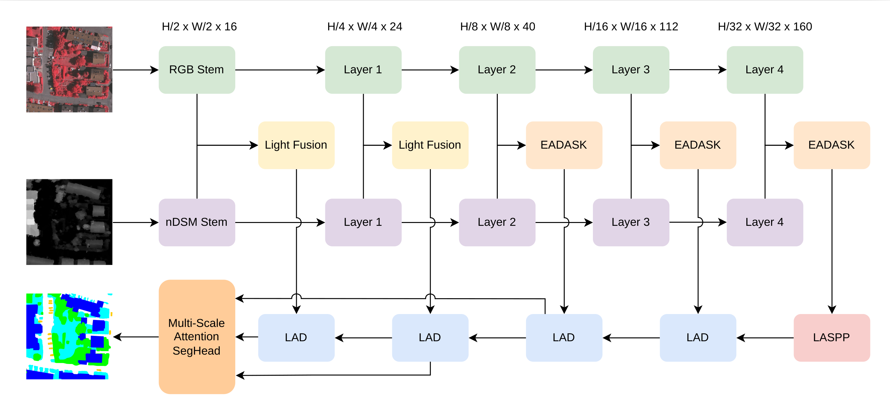

# LiEAF-Net

**LiEAF-Net: A Lightweight Multi-Scale Elevation-Aware Fusion Network for Multimodal Semantic Segmentation of High-Resolution Remote Sensing Imagery**

Furkat Sultonov, Mu-Gyeong Gong, Sang-Jae Park, Il-Min Kim, Jeehyun Kim, Sangseok Yun, Jae-Mo Kang

This repository contains the official PyTorch implementation of **LiEAF-Net**, a lightweight (6.50M-parameter) RGB–nDSM fusion network for semantic segmentation of aerial imagery, built around the proposed **EADASK** (Elevation-Aware Double-Attention Selective Kernel) fusion module. On the ISPRS Vaihingen and Potsdam benchmarks, LiEAF-Net matches or approaches segmentation networks with 4.8–35.7× more parameters, at a fraction of the compute.

| Dataset | mIoU | mF1 | OA | Params | GFLOPs (512²) | FPS (512², RTX A5000) |
|---|---|---|---|---|---|---|
| ISPRS Vaihingen | **83.59%** | 90.86% | 93.36% | 6.50M | 4.04 | 51.5 |
| ISPRS Potsdam   | **86.45%** | 92.58% | 91.39% | 6.50M | 4.04 | 51.5 |

Comparison against state-of-the-art RGB–nDSM fusion methods (Table I of the paper):

| Method | Params (M) | Vaihingen mIoU | Vaihingen mF1 | Vaihingen OA | Potsdam mIoU | Potsdam mF1 | Potsdam OA |
|---|---|---|---|---|---|---|---|
| RTFNet-18 | 31.00 | 82.17 | 89.91 | 93.30 | 85.72 | 92.18 | 90.95 |
| RTFNet-34 | 51.21 | 82.79 | 90.33 | 93.33 | 86.16 | 92.44 | 91.49 |
| CMGFNet | 43.68 | 79.95 | 88.42 | 92.51 | 82.39 | 90.18 | 88.98 |
| FEANet | 185.94 | 84.34 | 91.33 | 93.53 | 86.58 | 92.66 | 91.47 |
| SFAFMA | 232.08 | 84.01 | 91.11 | 93.40 | 85.79 | 92.22 | 91.16 |
| MFMamba | 62.40 | 84.08 | 91.16 | 93.46 | 85.31 | 91.93 | 90.53 |
| PACSCNet | 90.00 | 81.24 | 89.30 | 92.97 | 84.39 | 91.42 | 90.70 |
| SiMultiF† | 42.62 | 81.16 | 89.27 | 91.86 | — | — | — |
| HACMNet† | — | 82.04 | 89.86 | 91.94 | 84.02 | 91.15 | 91.04 |
| LMFNet† | 3.72 | 82.49 | 90.44 | 92.02 | 85.51 | 91.81 | 92.20 |
| CAINet | 13.80 | 82.64 | 90.26 | 93.01 | 85.26 | 91.90 | 90.81 |
| **LiEAF-Net (ours)** | **6.50** | **83.59** | **90.86** | **93.36** | **86.45** | **92.58** | **91.39** |

† results reported from the original publication; all other baselines were retrained from scratch under identical settings. See the paper for per-class F1 scores and full discussion.

## Architecture



Dual MobileNetV3-Large encoders extract RGB and nDSM feature pyramids in parallel. Shallow stages (H/2, H/4) are merged with lightweight fusion; deeper stages (H/8, H/16, H/32) use the proposed **EADASK** fusion module. The deepest fused features pass through a LASPP context module and a four-stage lightweight attention decoder (LAD) before a multi-scale attention segmentation head produces the final prediction.

## Contents

- [LiEAF-Net](#lieaf-net)
  - [Architecture](#architecture)
  - [Contents](#contents)
  - [Installation](#installation)
  - [Data preparation](#data-preparation)
  - [Pretrained weights](#pretrained-weights)
  - [Training](#training)
  - [Evaluation](#evaluation)
  - [Repository structure](#repository-structure)
  - [Citation](#citation)
  - [License and acknowledgments](#license-and-acknowledgments)

## Installation

Requires Python ≥ 3.8 and a CUDA-capable GPU (training/eval were run on an RTX A5000; any modern NVIDIA GPU with ≥ 8GB VRAM should work for this model, which is only 6.50M parameters).

```bash
conda create -n lieafnet python=3.8 -y
conda activate lieafnet

# install PyTorch matching your CUDA version, e.g.:
pip install torch torchvision --index-url https://download.pytorch.org/whl/cu121

pip install -r requirements.txt
```

The first time you build the model, torchvision will download ImageNet-pretrained MobileNetV3-Large weights automatically (used to initialize both encoder branches).

## Data preparation

We use the [ISPRS Vaihingen and Potsdam](https://www.isprs.org/education/benchmarks/UrbanSemLab/default.aspx) benchmarks. Download them from the official source, then follow the split and preprocessing below (matching what is reported in the paper).

**Splits used in the paper:**

- **Vaihingen** (33 tiles): test = tile IDs `[2, 4, 6, 8, 10, 12, 14, 16, 20, 22, 24, 27, 29, 31, 33, 35, 38]`, validation = tile `30`, the remaining tiles = train.
- **Potsdam** (38 tiles): test = tile IDs `[2_13, 2_14, 3_13, 3_14, 4_13, 4_14, 4_15, 5_13, 5_14, 5_15, 6_13, 6_14, 6_15, 7_13]`, validation = tile `2_10`, the remaining 22 tiles = train (tile `7_10` is excluded — it contains erroneous annotations in the official release).

**Preprocessing:** after splitting raw tiles into `train/valid/test` folders of `{images, masks, dsm}`, crop to 1024×1024 patches with `tools/vaihingen_patch_split_.py` / `tools/potsdam_patch_split_.py`, e.g.:

```bash
python tools/vaihingen_patch_split_.py \
    --img-dir data/vaihingen/train_images --mask-dir data/vaihingen/train_masks --dsm-dir data/vaihingen/train_dsm \
    --output-img-dir data/vaihingen/train/images_1024 --output-mask-dir data/vaihingen/train/masks_1024 --output-dsm-dir data/vaihingen/train/dsm_1024 \
    --mode train --split-size 1024 --stride 512
```

Repeat per split (`train`/`valid`/`test`) and dataset. The expected final layout (relative to the repo root) is:

```
data/
├── vaihingen/{train,valid,test}/{images_1024,masks_1024,dsm_1024}/
└── potsdam/{train,valid,test}/{images_1024,masks_1024,dsm_1024}/
```

`data/` is git-ignored — populate it locally, it is never committed.

The dataloaders (`geoseg/datasets/vaihingen_dataset_.py`, `potsdam_dataset_.py`) crop these 1024×1024 patches further to 512×512 during training via random-scale + smart-crop augmentation, and expect the nDSM stored per-pixel in the same coordinate frame as the RGB/mask patch (single-channel, raw scale — the model normalizes it internally).

## Pretrained weights

The final trained checkpoints for the numbers reported in the paper are **not stored in this repository** — they're hosted on Google Drive:

**[Download LiEAF-Net checkpoints (Google Drive)](https://drive.google.com/drive/folders/1uz5nExgFE1YWkPCZBrtfMTZm4IQ9YPby?usp=sharing)**

Download both files and place them at:

```
model_weights/
├── vaihingen/lieafnet-vaihingen-512-e100.ckpt
└── potsdam/lieafnet-potsdam-512-e105.ckpt
```

## Training

```bash
python train_supervision.py -c config/vaihingen/lieafnet.py
python train_supervision.py -c config/potsdam/lieafnet.py
```

Each config trains for 100 (Vaihingen) / 105 (Potsdam) epochs with AdamW (lr=6e-4, backbone lr=6e-5, weight decay=1e-2), Lookahead, and cosine warm restarts (T₀=15, T_mult=2), batch size 8, on 512×512 crops. Edit `gpus = [0]` near the top of the config to select a different GPU index, and `max_epoch`/`train_batch_size` if needed. Checkpoints are written to `model_weights/{dataset}/{weights_name}.ckpt`.

## Evaluation

```bash
python vaihingen_test.py -c config/vaihingen/lieafnet.py -o fig_results/vaihingen/lieafnet -t d4 --rgb
python potsdam_test.py   -c config/potsdam/lieafnet.py   -o fig_results/potsdam/lieafnet   -t d4 --rgb
```

**`-t d4` (test-time augmentation: horizontal/vertical flip, 90° rotation, multi-scale `[0.75, 1.0, 1.25]`) is required to reproduce the paper's reported numbers.** Running without `-t` evaluates single-scale, no-augmentation performance, which is lower on both datasets (82.31% vs. 83.59% mIoU on Vaihingen; 85.71% vs. 86.45% mIoU on Potsdam) — both are legitimate numbers, just not the same protocol. We verified both checkpoints reproduce the paper's exact reported mIoU/mF1/OA under `-t d4` before publishing this repository.

`compute_flops.py -c <config>` reports parameters and GFLOPs for any config's model (used for the paper's Table II parameter/GFLOPs figures):

```bash
python compute_flops.py -c config/vaihingen/lieafnet.py --size 1024
python compute_flops.py -c config/potsdam/lieafnet.py   --size 1024
```

## Repository structure

```
lieafnet/
├── geoseg/                       # Python package
│   ├── datasets/                  # DSM-aware Vaihingen/Potsdam datasets + augmentations
│   ├── losses/                    # Loss functions (UnetFormerLoss = CE + Dice, used in the paper)
│   └── models/
│       └── lieafnet.py            # LiEAFNet (the proposed model) + the EADASK fusion module
├── tools/                         # Config loader, metrics (mIoU/F1/OA), patch-splitting scripts
├── config/
│   ├── vaihingen/lieafnet.py      # Main Vaihingen training/eval config
│   └── potsdam/lieafnet.py        # Main Potsdam training/eval config
├── model_weights/                 # Trained checkpoints (git-ignored; download from Google Drive)
├── train_supervision.py           # Training entrypoint (PyTorch Lightning)
├── vaihingen_test.py              # Vaihingen evaluation entrypoint
├── potsdam_test.py                # Potsdam evaluation entrypoint
└── compute_flops.py                # Parameter count / GFLOPs utility
```

## Citation

If you use LiEAF-Net in your research, please cite:

```bibtex
@article{sultonov2026lieafnet,
  title   = {LiEAF-Net: A Lightweight Multi-Scale Elevation-Aware Fusion Network for
             Multimodal Semantic Segmentation of High-Resolution Remote Sensing Imagery},
  author  = {Sultonov, Furkat and Gong, Mu-Gyeong and Park, Sang-Jae and Kim, Il-Min
             and Kim, Jeehyun and Yun, Sangseok and Kang, Jae-Mo},
  journal = {IEEE Geoscience and Remote Sensing Letters},
  year    = {2026},
  note    = {Accepted}
}
```

*(This paper has been accepted but not yet published)*

## License and acknowledgments

Released under **GPL-3.0** (see `LICENSE`). The training pipeline is adapted from **[GeoSeg](https://github.com/WangLibo1995/GeoSeg)** by Libo Wang et al. (also GPL-3.0) — thanks to the GeoSeg authors for the toolbox this builds on.
